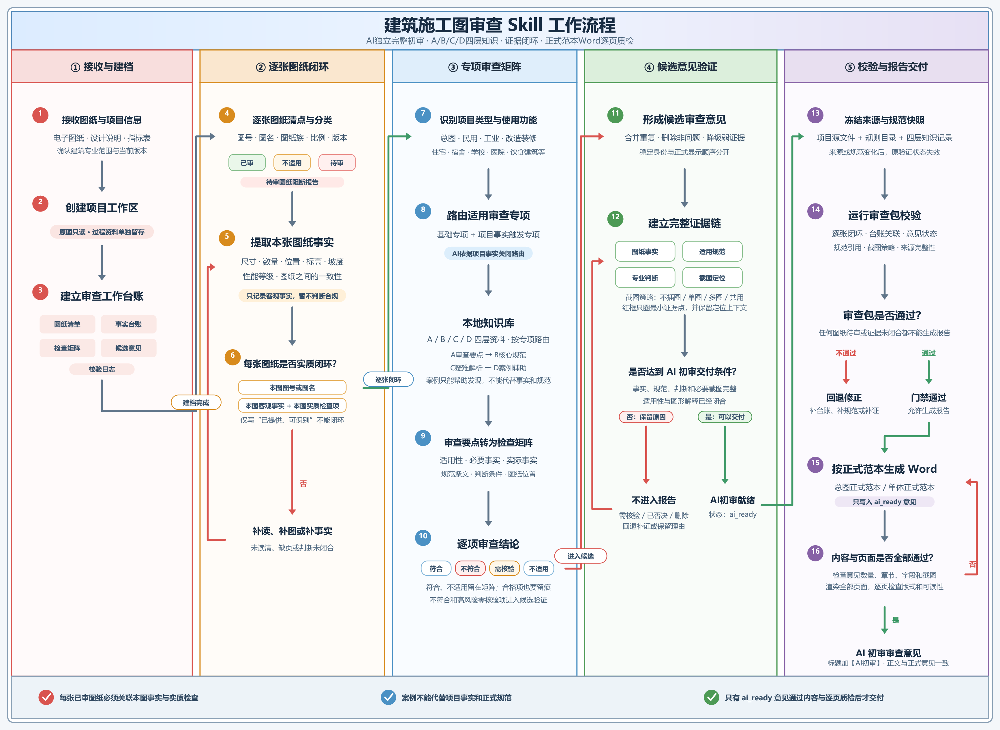
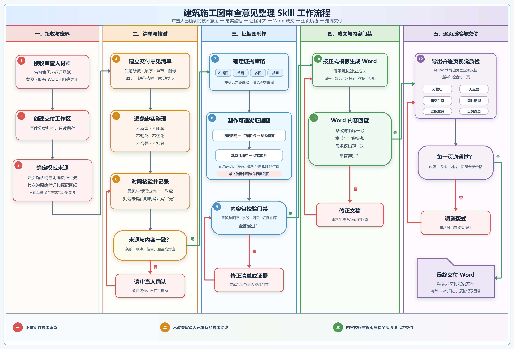

[中文](README.md) · English

# 🏗️ Kangmaojian Skills

#### Agent Skills repeatedly used in architectural construction-drawing review and verified with anonymous regressions

This repository publishes two deliberately separate workflows. One forms new architectural review conclusions from drawing facts and lawfully obtained local standards. The other faithfully packages conclusions already authored and approved by a reviewer.

The repository contains Skill instructions, scripts, anonymous tests, and privacy-scrubbed templates only. It does not include standards, project drawings, client information, real review reports, or private knowledge indexes.

## 📋 Contents

| Skill | In one sentence | Links |
|---|---|---|
| 🏢 [building-review](#-building-review) | Review architectural drawings sheet by sheet and form new, evidence-linked architectural opinions | [SKILL.md](building-review/SKILL.md) · [Workflow](media/building-review-workflow.svg) |
| 📝 [review-opinion-delivery](#-review-opinion-delivery) | Package reviewer-authored opinions and evidence into a verified Word deliverable without changing technical conclusions | [SKILL.md](review-opinion-delivery/SKILL.md) · [Workflow](media/review-opinion-delivery-workflow.svg) |

## 📦 Installation

In Codex, Claude Code, or another Agent Skills-compatible tool, say:

```text
Install this skill: https://github.com/jack20040828/kangmaojian-skills/tree/main/building-review
```

or:

```text
Install this skill: https://github.com/jack20040828/kangmaojian-skills/tree/main/review-opinion-delivery
```

With the official Codex installer, select the first-level skill directory:

```powershell
python install-skill-from-github.py --repo jack20040828/kangmaojian-skills --path building-review
python install-skill-from-github.py --repo jack20040828/kangmaojian-skills --path review-opinion-delivery
```

Start a new agent session after installation so the skills are rediscovered.

## ✨ Skills

### 🏢 building-review

> State what each drawing actually shows before deciding whether it complies.

Use this Skill for architectural site-plan, single-building, and architecture-owned specialty review. In schema v1.6 the agent independently inventories sheets, records facts, routes specialties, searches the user's lawful local sources, checks standards and cross-sheet consistency, closes evidence, and validates Word output without human confirmation, review, or adjudication gates. Only `ai_ready` findings enter the AI-initial report.

Good for:

- Architectural site plans, single-building drawings, and architecture-owned fire-safety, accessibility, waterproofing, energy, and green-building topics.
- Internal technical review that needs per-sheet closure, source citations, and evidence screenshots.
- AI-initial architectural review reports in the formal delivery template, with page-by-page Word QA.

Not for:

- Packaging opinions that already exist; use `review-opinion-delivery`.
- Structural, plumbing, electrical, or HVAC technical review.
- Administrative submission, qualification, or seal review.
- Formal citations from model memory when no lawful, current source is available.

Example prompts:

```text
Use building-review to inspect this architectural single-building drawing set.
Run an evidence-driven architectural site-plan review.
Review these architectural drawings and produce AI-initial opinions with evidence.
```

[](media/building-review-workflow.svg)

The public version passes 68 anonymous regression scenarios and 6 CAD safety-guard tests. v1.6 requires four local knowledge layers: A review checklists, B core standards, C interpretation notes, and D cases; drawing facts and layer-B standards remain the basis for formal conclusions. No Chinese standards, local policies, or case library are bundled. Single-building and site-plan reports inherit the formal Word templates, with `【AI初审】` as the only visible stage distinction in the title.

→ [SKILL.md](building-review/SKILL.md) · [High-resolution workflow](media/building-review-workflow.svg) · [Runtime requirements](building-review/references/runtime-requirements.md)

### 📝 review-opinion-delivery

> The reviewer owns the technical conclusion; the Skill makes it faithful, traceable, and deliverable.

Use this Skill to turn existing reviewer notes, marked drawings, screenshots, and the latest approved Word file into a formal deliverable. It preserves the latest approved document as the content authority, logs deterministic corrections, verifies opinion types and evidence provenance, and completes content plus page-by-page visual QA.

Good for:

- Packaging existing notes, marked PDFs, and screenshots into Word.
- Updating the latest reviewer-approved Word with evidence and consistent formatting.
- Comparing drafts and final documents while requiring confirmed mappings for deletion, narrowing, and many-to-one consolidation.

Not for:

- Finding new technical issues in drawings.
- Adding standards, strengthening or weakening conclusions, or inferring responsibility.
- Silently choosing a plausible version when authoritative sources conflict.

Example prompts:

```text
Use review-opinion-delivery to package these construction-drawing review opinions.
Combine my reviewer notes, marked PDF, and latest approved Word into the final deliverable.
Verify and format this already-approved architectural internal-review report.
```

[](media/review-opinion-delivery-workflow.svg)

The public version passes the anonymous v1.1 package regression and the v1.2 correction, process-trace, evidence-card, opinion-type, and semantic-diff regressions.

→ [SKILL.md](review-opinion-delivery/SKILL.md) · [High-resolution workflow](media/review-opinion-delivery-workflow.svg) · [Runtime requirements](review-opinion-delivery/references/runtime-requirements.md)

## 🧰 Runtime

| Capability | Main requirements |
|---|---|
| Both skills | Python 3.11+, `python-docx`, and Microsoft Word or LibreOffice for DOCX rendering |
| building-review | `pypdf`; Windows plus AutoCAD/Core Console only when CAD automation is needed |
| review-opinion-delivery | `Pillow`, `pypdfium2`; Word COM export is available on Windows |

See each skill's `runtime-requirements.md` for dependencies and environment variables. The scripts validate traceability, formatting, and consistency. They do not replace professional architectural judgment or statutory construction-drawing review.

## 🔒 Public-release boundary

- No standards, policies, training material, case screenshots, or private indexes.
- No real project names, drawings, client data, review reports, or evidence screenshots.
- The two Word templates have their author, last-modifier, custom properties, and revision-session identifiers removed.
- GitHub Actions reruns anonymous regressions and blocks machine-local paths, private indexes, and Word privacy metadata.

## 🔄 Maintainer sync

`sync-manifest.json` provides an exact per-file allowlist for synchronizing the two development-source Skills. Newly discovered source files are blocked until explicitly classified. Local knowledge indexes, project data, deliverables, caches, and unselected working assets are never copied to the public repository.

Run a read-only preflight first:

```powershell
powershell -ExecutionPolicy Bypass -File scripts/sync-public-skills.ps1 -SourceRoot "<development root containing both Skill directories>" -Check
```

Apply a validated snapshot to the local public repository:

```powershell
powershell -ExecutionPolicy Bypass -File scripts/sync-public-skills.ps1 -SourceRoot "<development root>" -Apply
```

Apply, commit, push, and wait for GitHub Actions in one command:

```powershell
powershell -ExecutionPolicy Bypass -File scripts/sync-public-skills.ps1 -SourceRoot "<development root>" -Apply -Publish -Message "Sync public Skills"
```

The synchronizer first builds a privacy-safe snapshot in a temporary directory, then runs syntax checks, public-boundary validation, and the complete anonymous regression suites for both Skills. It writes only after every gate passes and finally verifies that the development-source tree hashes are unchanged. `-Publish` is restricted to `main` and refuses unrelated working-tree changes.

## 🌟 About

These Skills grew out of repeated use, reviewer correction, and delivery QA in real architectural drawing-review workflows. They make evidence chains, professional boundaries, reviewer authority, and page-by-page verification reusable.

Issues and improvement suggestions are welcome.

[MIT License](LICENSE) · Free to use, modify, and redistribute

Made by [@jack20040828](https://github.com/jack20040828)
